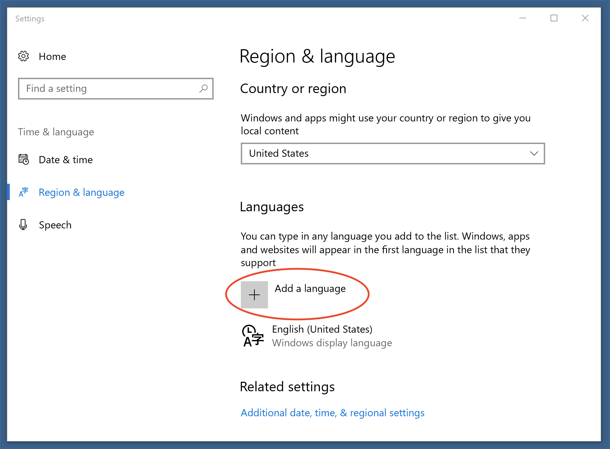
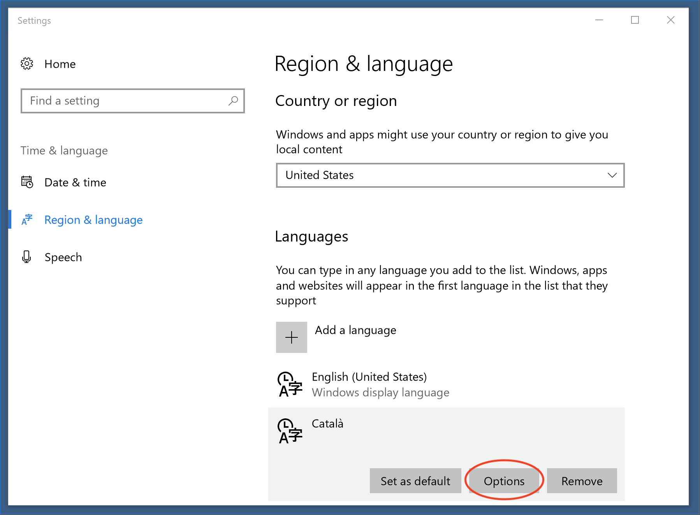
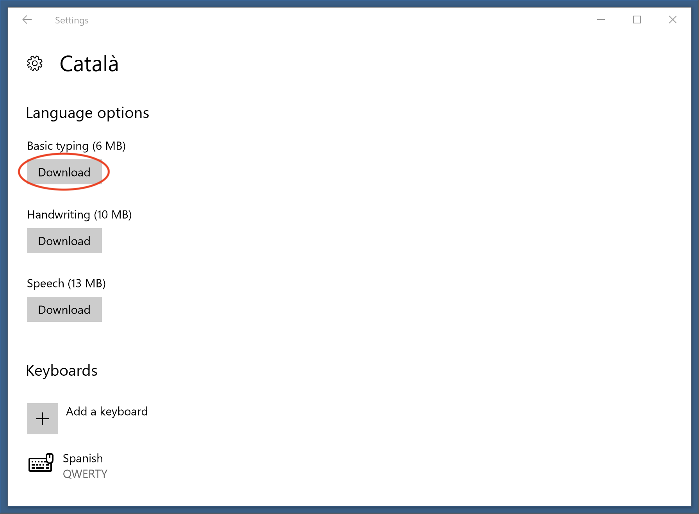

# Spell Check package
[](https://travis-ci.org/atom/spell-check) [](https://ci.appveyor.com/project/Atom/spell-check/branch/master) [](https://david-dm.org/atom/spell-check)

Highlights misspelling in Atom and shows possible corrections.

Use <kbd>cmd-shift-:</kbd> to bring up the list of corrections when your cursor is on a misspelled word.

By default spell check is enabled for the following files:

* Plain Text
* GitHub Markdown
* Git Commit Message
* AsciiDoc
* reStructuredText

You can override this from the _Spell Check_ settings in the Settings View (<kbd>cmd-,</kbd>). The Grammars config option is a list of scopes for which the package will check for spelling errors.

To enable _Spell Check_ for your current file type: put your cursor in the file, open the [Command Palette](https://github.com/atom/command-palette)
(<kbd>cmd-shift-p</kbd>), and run the `Editor: Log Cursor Scope` command. This will trigger a notification which will contain a list of scopes. The first scope that's listed is the one you should add to the list of scopes in the settings for the _Spell Check_ package. Here are some examples: `source.coffee`, `text.plain`, `text.html.basic`.

## Mac

On the Mac, in most cases checking "Use System" and clearing the check on "Use Locales" will be the most appropriate. The Mac's dictionary library uses all of the user's loaded dictionaries and doesn't require any customization within Atom.

If "Use Locales" is set, those dictionaries will always be based on individual `.dic` files.

You can use "Use System" and "Use Locales" at the same time.

## Windows

On Windows, "Use Locales" is needed to use the built-in Windows Spelling API because you can enable or disable checking based on desired language.

## Changing the dictionary

To change the language of the dictionary, set the "Locales" configuration option to the IETF tag (en-US, fr-FR, etc). More than one language can be used, simply separate them by commas.

### Missing Languages

This plugin uses the existing system dictionaries. If a locale is selected that is not installed, a warning will pop up when a document that would be spell-checked is loaded. To disable this, either remove the incorrect language from the "Locales" configuration or clear the check on "Use Locales" to disable it entirely.

To get the search paths used to look for a dictionary, make sure the "Notices Mode" is set to "console" or "both", then reload Atom. The developer's console will have the directory list.

#### Hunspell Dictionaries

For all platforms, a Hunspell-compatible dictionary is supported. To use this, a `.dic` and `.aff` need to be located in one of the default search directories or in a directory entered into "Locale paths" (multiples may be entered with commas separating them). If the appropriate files are found for the locale and "Use Locales" is checked, then the dictionary will be used.

For example, if the following is set, then `/usr/share/hunspell/en_US.dic` will be used:

- Use Locales: checked
- Locales: `en-US`
- Locale Paths: `/usr/share/hunspell`

If "Locales" is not provided, then the user's current language will be inferred from environmental settings.

In addition to what is provided, the following paths are checked:

- `/usr/share/hunspell` (Linux only)
- `/usr/share/myspell` (Linux only)
- `/usr/share/myspell/dicts` (Linux only)
- `/` (Mac only)
- `/System/Library/Spelling` (Mac only)
- `C:\` (Windows only)

On Windows, the Windows spell checker will also be checked (see below) based on the locale paths.

Dictionaries can be downloaded from various sites (such as [wooorm's repository](https://github.com/wooorm/dictionaries) or [LibreOffice's](https://github.com/LibreOffice/dictionaries)), but the file has to be renamed `locale.dic` and `locale.aff`.

*Example locations to download are not an endorsement.*

#### Windows 8 and Higher

For Windows 8 and 10, this package uses the Windows spell checker, so you must install the language using the regional settings before the language can be chosen inside Atom.



If your Windows user does not have Administration privileges, you'll need to do an extra step once the language has been added to enable the spell checker. To do so, you need to install the "Basic typing" language option by following the next steps (you'll be asked for your administrator password):





Once the additional language is added, Atom will need to be restarted.

*Previously, setting `SPELLCHECKER_PREFER_HUNSPELL` environment variable would change how checking works. Now this is controlled by the system and locale checker to use the operating system version or Hunspell respectively.*

If locale is not set, Atom will attempt to use the current locale from the environment variable; if that is missing, `en-US` will be used. The dictionary for `en-US` is shipping with Atom but all other locale-based dictionaries will need to be downloaded from another source.

### Debian, Ubuntu, and Mint

On Ubuntu, installing "Language Support" may solve problems with the dictionaries. For other distributions (or if Language Support doesn't work), you may use `apt` to install the dictionaries.

```
sudo apt-get install hunspell-en-gb
sudo apt-get install myspell-en-gb
```

On RedHat, the following should work for Italian:

```
sudo dnf install hunspell
sudo dnf install hunspell-it
```

You can get a list of currently installed languages with:

```
/usr/bin/hunspell -D
```

Atom may require a restart to pick up newly installed dictionaries.

### Arch Linux

A language may be installed by running:

```
pacman -S hunspell-en_GB
```

For the time being, a soft link may be required if the dictionary provided is "large".

```
cd /usr/share/hunspell
sudo ln -s en_GB-large.dic en_GB.dic
sudo ln -s en_GB-large.aff en_GB.aff
```

## Plugins

_Spell Check_ allows for plugins to provide additional spell checking functionality. See the `PLUGINS.md` file in the repository on how to write a plugin.

## Debugging

Debugging messages for this library can be enabled by going into the developer console and running the following:

```
localStorage.debug = 'spell-check:*'
```

A reload of the window may be required.
